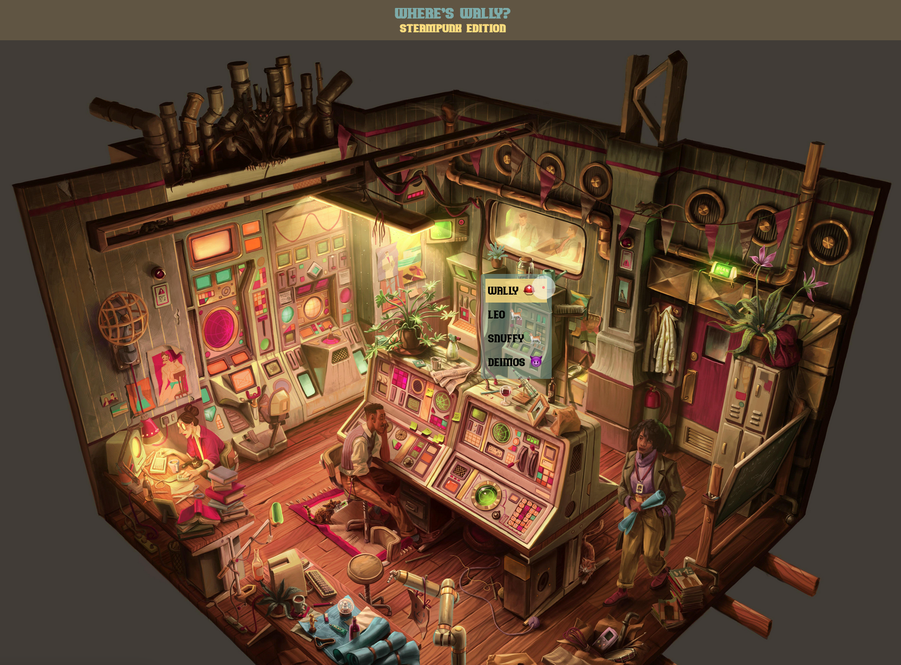

# project-photo-tagging

A photo tagging app themed as a "Where's Wally" app, implemented using React and Firestore/Firebase.

Can you find the following characters?

-   Wally from "Where's Wally?" (or Waldo for those in the US)
-   Leo the naughty cat
-   Snuffy the curious cat
-   Deimos the gargoyle



# Description

## What it does

The objective for users is to locate a number of hidden characters in the background image. In order to do so, one can right click the image to open a context menu, providing a list of characters that need to be found. When the user clicks on a character entry in the menu, the app will validate with the backend for the character's location and check if there is overlap with the radial cursor.

## Technologies used

-   The frontend is implemented in **React** using **Javascript**, as **React** allows for shorter development times and is relatively unopinionated.
-   The backend uses **Firebase/Firestore**, chosen because **Firestore** is lightweight and simple to set up by its nature of being a JSON based database.

## Challenges faced

### Cursor Detection

Detecting collision between a circle (i.e., the cursor radius) and a rectangle (i.e., the object bounding box) was a little more complex than first anticipated. However, there is a fairly straightforward solution to detect collision - compare the distance between the center of the circle and the center of the rectangle.

-   Full credits for the solution go to the following [Stack Overflow Answer](https://stackoverflow.com/questions/21089959/detecting-collision-of-rectangle-with-circle).

**Step 1.** Calculate the vertical and horizontal distances between the centres:

```
let distX = Math.abs(circle.x - rect.x - rect.w / 2);
let distY = Math.abs(circle.y - rect.y - rect.h / 2);
```

Where `circle.x` & `circle.y` are the coordinates of the circle's centre.

**Step 2.** If centre-to-centre distance is greater than half the circle's distance + half rectangle's distance, then they are too far to be colliding:

```
if (distX > rect.w / 2 + circle.r) {
    return false;
}

if (distY > rect.h / 2 + circle.r) {
    return false;
}
```

**Step 3.** If distance is less than half rectangle's distance, then they are colliding.

```
if (distX <= rect.w / 2) {
    return true;
}

if (distY <= rect.h / 2) {
    return true;
}
```

**Further steps.** There is an additional case to to considered that involves the detection of collisions between the corner of a rectangle (bounding box) and the circle (the selection cursor), which will not be covered here.

### Variable viewport sizes and its impact on cursor detection radius

Earlier iterations featured the background image scaling to fit the viewport, which lead to variable background sizes (dependent on the users' screen size), affecting collision calculations between the users' radial cursor and the object bounding boxes.

Imagine if a rectangle was drawn on a balloon and then that balloon was inflated -- this causes the rectangle's coordinates to change -- and so a similar difficulty arises when the image is able to vary in size.

Ultimately, the decision was made to go with a fixed background image size for the sake of simplicity and to ensure that collision calculations could be made without the need for additional conversion calculations.

## Future considerations

Given more time, there are opportunities to add additional backgrounds with additional characters or objects to be found. These could be offered to the user from a home page featuring a "background select" feature.

# How to install & run the project

-   The project is best accessed using the github.io link: [lxpan.github.io/project-photo-tagging/](lxpan.github.io/project-photo-tagging/).

# Attribution

Credits for the awesome image go to `u/jkcrosbyfun` on [r/wimmelbilder/](https://www.reddit.com/r/wimmelbilder/comments/jdbdw0/i_thought_id_share_a_piece_i_finished_earlier/)
